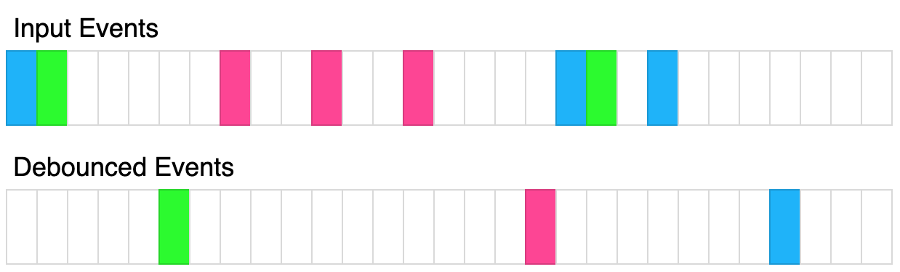

# Debounce

Given a function `fn` and a time in milliseconds `t`, return a **debounced** version of that function.

A **debounced** function is a function whose execution is delayed by `t` milliseconds and whose execution is cancelled if it is called again within that window of time. The debounced function should also receive the passed parameters.

For example, let's say `t = 50ms`, and the function was called at `30ms`, `60ms`, and `100ms`. The first 2 function calls would be cancelled, and the 3rd function call would be executed at `150ms`. If instead `t = 35ms`, The 1st call would be cancelled, the 2nd would be executed at `95ms`, and the 3rd would be executed at `135ms`.



The above diagram shows how debounce will transform events. Each rectangle represents 100ms and the debounce time is 400ms. Each color represents a different set of inputs.

Please solve it without using lodash's `_.debounce()` function.

### Example 1:

```js
Input:
t = 50
calls = [
  {"t": 50, inputs: [1]},
  {"t": 75, inputs: [2]}
]
Output: [{"t": 125, inputs: [2]}]
Explanation:
let start = Date.now();
function log(...inputs) {
  console.log([Date.now() - start, inputs ])
}
const dlog = debounce(log, 50);
setTimeout(() => dlog(1), 50);
setTimeout(() => dlog(2), 75);

The 1st call is cancelled by the 2nd call because the 2nd call occurred before 100ms
The 2nd call is delayed by 50ms and executed at 125ms. The inputs were (2).
```

### Example 2:

```js
Input:
t = 20
calls = [
  {"t": 50, inputs: [1]},
  {"t": 100, inputs: [2]}
]
Output: [{"t": 70, inputs: [1]}, {"t": 120, inputs: [2]}]
Explanation:
The 1st call is delayed until 70ms. The inputs were (1).
The 2nd call is delayed until 120ms. The inputs were (2).
```

### Example 3:

```js
Input:
t = 150
calls = [
  {"t": 50, inputs: [1, 2]},
  {"t": 300, inputs: [3, 4]},
  {"t": 300, inputs: [5, 6]}
]
Output: [{"t": 200, inputs: [1,2]}, {"t": 450, inputs: [5, 6]}]
Explanation:
The 1st call is delayed by 150ms and ran at 200ms. The inputs were (1, 2).
The 2nd call is cancelled by the 3rd call
The 3rd call is delayed by 150ms and ran at 450ms. The inputs were (5, 6).
```

## Constraints:

- `0 <= t <= 1000`
- `1 <= calls.length <= 10`
- `0 <= calls[i].t <= 1000`
- `0 <= calls[i].inputs.length <= 10`

### Hint:

1. You execute code with a delay with "ref = setTimeout(fn, delay)". You can abort the execution of that code with "clearTimeout(ref)"
2. Whenever you call the function, you should abort any existing scheduled code. Then, you should schedule code to be executed after some delay.

# DEBOUNCE IN JS

In JavaScript, debounce is a technique used to control how often a particular function is executed, especially in response to frequent events such as user input (e.g., keystrokes, mouse movements, or scroll events). The purpose of debouncing is to ensure that the function is only called once after a certain period of inactivity, which can help improve performance and prevent excessive or unnecessary function calls.

Imagine a scenario where you have an event listener attached to an input field, and you want to perform some action whenever the user types something in the field. Without debounce, every keystroke would trigger the event handler function, causing it to be called repeatedly in quick succession, even if the user is still typing. This might lead to performance issues or undesired behavior in some cases.

To address this, you can use the debounce technique to delay the execution of the function until the user pauses typing for a specific duration. Here's a basic implementation of a debounce function in JavaScript:

```javascript
function debounce(func, delay) {
  let timerId;

  return function (...args) {
    clearTimeout(timerId);
    timerId = setTimeout(() => {
      func.apply(this, args);
    }, delay);
  };
}
```

In the debounce function above, we pass two parameters: `func`, which represents the function we want to debounce, and `delay`, which is the time period in milliseconds to wait before actually executing the function.

The debounce function returns a new function that wraps the original `func`. When this new function is called, it first clears any existing timers using `clearTimeout`, then sets a new timer using `setTimeout`. The `setTimeout` function schedules the actual execution of `func` after the specified `delay` has passed since the last call to the new debounced function.

Here's an example of using the debounce function:

```javascript
// Suppose we have an input field with an event listener for the 'input' event
const inputField = document.getElementById("myInput");

function handleInput() {
  console.log("Input value:", inputField.value);
}

// Debounce the handleInput function to only execute once every 300 milliseconds
const debouncedHandleInput = debounce(handleInput, 300);

// Attach the debounced function as the event handler
inputField.addEventListener("input", debouncedHandleInput);
```

Now, with this implementation, the `handleInput` function will only be called once after the user stops typing for 300 milliseconds, even if they type rapidly within that time period. This can help optimize the performance of applications that handle frequent events.
