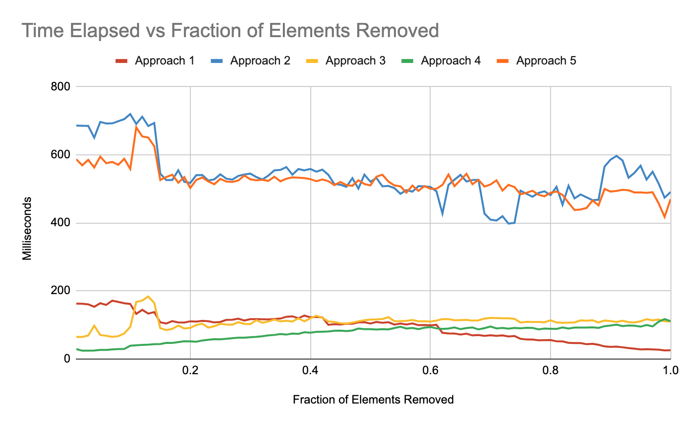

# Filter Elements from Array

Given an integer array `arr` and a filtering function `fn`, return a filtered array `filteredArr`.

The `fn` function takes one or two arguments:

- `arr[i]` - number from the `arr`
- `i` - index of `arr[i]`

`filteredArr` should only contain the elements from the `arr` for which the expression `fn(arr[i], i)` evaluates to a **truthy** value. A **truthy** value is a value where `Boolean(value)` returns `true`.

> Please solve it without the built-in Array.filter method.

#### Example 1:

```
Input: arr = [0,10,20,30], fn = function  greaterThan10(n) { return  n > 10; }
Output: [20,30]
Explanation: const  newArray = filter(arr, fn); // [20, 30]
The  function  filters  out  values  that  are  not  greater  than 10
```

#### Example 2:

```
Input: arr = [1,2,3], fn = function  firstIndex(n, i) { return  i === 0; }
Output: [1]
Explanation: fn  can  also  accept  the  index  of  each  element. In  this  case, the  function  removes  elements  not  at  index 0
```

#### Example 3:

```
Input: arr = [-2,-1,0,1,2], fn = function  plusOne(n) { return  n + 1 }
Output: [-2,0,1,2]
Explanation: Falsey  values  such  as  0  should  be  filtered  out.
```

#### Constraints:

- `0 <= arr.length <= 1000`
- `-10^9 <= arr[i] <= 10^9`

#### Hint:

1. Start by declaring a new array which will eventually be returned.
2. In Javascript, there is the concept of "truthiness" and "falsiness". Values such as 0, undefined, null, and false are falsy. Most values are truthy: 1, {}, [], true, etc. In Javascript, the contents of if-statements don't need to be booleans. You can say "if ([1,2,3]) {}", and it's equivalent to saying 'if (true) {}".
3. Loop over each element in the array. If fn(arr[i]) is truthy, push it to the array.

## filter() in JavaScript

In JavaScript, you can filter elements from an array using the `filter()` method. The `filter()` method creates a new array with all elements that pass the condition specified by the provided callback function. Here's how you can use it:

Syntax:

```javascript
const  newArray = originalArray.filter(callback(element[, index[, array]])[, thisArg])
```

Parameters:

- `callback`: A function that tests each element of the array. It should return `true` to include the element in the new array, or `false` to exclude it. It takes three arguments:
- `element`: The current element being processed in the array.
- `index` (optional): The index of the current element in the array.
- `array` (optional): The array on which `filter` was called.
- `thisArg` (optional): Value to use as `this` when executing the callback function.

Example: Let's say we have an array of numbers and we want to filter out all even numbers:

```javascript
const originalArray = [1, 2, 3, 4, 5, 6, 7, 8, 9, 10];
const newArray = originalArray.filter((element) => element % 2 !== 0);
console.log(newArray); // Output: [1, 3, 5, 7, 9]
```

In this example, the `filter()` method is used with an arrow function that checks if the element is not even (i.e., the remainder of dividing the element by 2 is not 0). The new array `newArray` will contain all the elements that meet this condition, which are the odd numbers from the original array.

You can customize the callback function according to your filtering requirements, like filtering out certain strings, objects, or elements based on specific conditions.

## Push in JavaScript

In JavaScript, "push" is a method used to add one or more elements to the end of an array. It is one of the fundamental array manipulation methods. The syntax for the "push" method is as follows:

```javascript
array.push(element1, element2, ..., elementN);
```

Here's what each part means:

- `array`: This is the array to which you want to add elements.
- `element1, element2, ..., elementN`: These are the elements you want to add to the end of the array. You can add one or multiple elements separated by commas.

Example 1: Pushing a single element into an array:

```javascript
let fruits = ["apple", "banana", "orange"];
fruits.push("grape");
console.log(fruits); // Output: ['apple', 'banana', 'orange', 'grape']
```

Example 2: Pushing multiple elements into an array:

```javascript
let numbers = [1, 2, 3];
numbers.push(4, 5, 6);
console.log(numbers); // Output: [1, 2, 3, 4, 5, 6]
```

The "push" method modifies the original array and returns the new length of the array after the elements are added. If you want to add elements to the beginning of an array, you can use the "unshift" method.

## Solution

### Overview

This question asks you to write a function that filters elements from an array based on the output of a _**callback**_ function. Alongside map and reduce, it is one of the most commonly used and important functions in JavaScript.

It is recommended you first read the editorial for [map](https://leetcode.com/problems/apply-transform-over-each-element-in-array/editorial) as that editorial includes a discussion on callbacks not included here.

#### Truthy and Falsy

In this question, you are asked to remove all values from an array that aren't _**truthy**_ (i.e. remove all _**falsy**_ values). But what does that mean? JavaScript has true boolean values of `true` and `false`. But you are actually allowed to put any value inside an `if` statement. That value will be _**coerced**_ into a boolean based on it's "truthiness".

All values are considered _**truthy**_ except the following:

- `false`
- All forms of zero, meaning `0`, `-0` (output of `0/-1`), and `0n` (output of `BigInt(0)`)
- `NaN` ("Not a Number", one way to get it is with `0/0`)
- `""` (empty string)
- `null`
- `undefined`

##### Why does this language feature exist?

The short answer is it can be convenient. Imagine you have a textfield which edits a variable `userInput` which is initially null.

Rather than writing:

```javascript
if (userInput !== null && userInput !== "") {
  // uploadToDatabase(userInput)
}
```

You can shorten this to:

```javascript
if (userInput) {
  // uploadToDatabase(userInput)
}
```

However, it is easy to not think carefully about your code and create bugs by not being explicit about what values are valid. For example, zero or an empty string might be completely valid inputs and the above code will result in a bug.

##### Truthiness and Logical Operators

It is not uncommon to see code like this in a JavaScript codebase:

```javascript
const stringVal = textInput || "Default Value";
```

To an experienced JavaScript developer, this makes perfect sense. But developers from other backgrounds might find this very confusing. Why is a logical operator returning a string?

This is because, in JavaScript, logical operators don't return booleans; they return one of the two operands provided to them. At first this is confusing, but it is actually quite elegant and allows you to write very terse code.

- The _**OR**_ operator `||` returns the first value if the first value is truthy (without evaluating the 2nd value). Otherwise it returns the second value.
- The _**AND**_ operator `&&` returns the first value if the first value is falsy (without evaluating the 2nd value). Otherwise it returns the 2nd value.
- The _**Nullish Coalescing**_ operator `??` is identical to `||` except it only treats `null` and `undefined` as falsy.

An easy way to remember this is by knowing the logical operator will return the _**last**_ value it _**needed**_ to evaluate. For example, _**OR**_ is immediately true if the first value is true, thus it will return the first value iff it is truthy.

The reason this is elegant is because for true booleans, this algorithm actually works exactly as you would expect. Try it out for yourself! However you can also use them to write short code for non-boolean operations. And even if you don't use these operators for that purpose yourself, it's important to understand them for reading other's code.

A common use-case is for choosing the first truthy value from a list:

```javascript
let val;
if (a) {
  val = a;
} else if (b) {
  val = b;
} else {
  val = c;
}
```

can be replaced with:

```javascript
const val = a || b || c;
```

You could also conditionally execute some code:

```javascript
if (a && b) {
  func();
}
```

can be replaced with:

```javascript
a && b && func();
```

### Built-in Array.filter

This question asks you to reimplement the `Array.filter` method, which is one of the most heavily used array methods in JavaScript. However there are four small differences between your implementation and the standard library.

- `Array.filter` is a method on the Array prototype. This implementation is a function that accepts the array as the 1st argument.
- The callback passed to `Array.filter` has a reference to the original array passed as the 3rd argument. This implementation's callback only accepts two arguments.
- `Array.filter` optionally allows you pass a `thisArg` as the 2nd parameter. If provided, the passed callback will be bound to that context (assuming the callback isn't an arrow function as they can't be bound).
- `Array.filter` handles sparse arrays. For example, if you write code `let arr = Array(100); arr[1] = 10;`, `Array.filter` will only look at index 1 and the empty indices will automatically be filtered out.

#### Approach 1: Push Values onto New Array

You can create a new array and push all values where `fn(arr[i], i)` returns a truthy value. This is done by iterating over each element in the original array.

```javascript
var filter = function (arr, fn) {
  const newArr = [];
  for (let i = 0; i < arr.length; ++i) {
    if (fn(arr[i], i)) {
      newArr.push(arr[i]);
    }
  }
  return newArr;
};
```

#### Approach 2: For...in Loop

For...in loops are more commonly used to iterate over the keys on an object. However, they can also be used to iterate over the indices of an array. This approach is notable because it respects sparse arrays by omitting empty indices. For example, if you wrote `let arr = Array(100); arr[1] = 10;`, this approach would only apply a filter on the single element and it will automatically remove all the empty values.

An interesting thing to note is that this is the most similar to how the built-in `Array.filter` works. Because `Array.filter` needs to handle sparse arrays, it is usually slower than an optimal custom implementation that assumes arrays aren't sparse.

Another thing to note is that since for...in loops include keys on the object's prototype, it is often better to use `Object.keys()`.

```javascript
var filter = function (arr, fn) {
  const newArr = [];
  for (const stringIndex in arr) {
    const i = Number(stringIndex);
    if (fn(arr[i], i)) {
      newArr.push(arr[i]);
    }
  }
  return newArr;
};
```

#### Approach 3: Preallocate Memory

Pushing elements onto an array can be a slow operation. This is because the array may not have space for the new element and will need to be resized. Initializing the array with `new Array(size)` can avoid these expensive resizing operations.

At the end, we will remove empty elements by popping them from the end of the array. Note that this algorithm will perform the fastest in the case where few elements are removed from the original array.

```javascript
var filter = function (arr, fn) {
  let size = 0;
  const newArr = new Array(arr.length);
  for (let i = 0; i < arr.length; ++i) {
    if (fn(arr[i], i)) {
      newArr[size] = arr[i];
      size++;
    }
  }
  // Ensure new array is of length size
  while (newArr.length > size) {
    newArr.pop();
  }
  return newArr;
};
```

#### Approach 4: Perform Operations In-Place

This approach is similar to Approach 3, but utilizes the memory of the input array, avoiding the cost of creating a new array.

Note that this solution is efficient, but it generally is not a good idea to mutate arguments passed into a function. This is because the user of the function may not expect their array to be modified and this could result in bugs. Note that the built-in `Array.filter` does not mutate the input array.

```javascript
var filter = function (arr, fn) {
  let size = 0;
  for (let i = 0; i < arr.length; ++i) {
    if (fn(arr[i], i)) {
      arr[size] = arr[i];
      size++;
    }
  }
  // Ensure array is of length size
  while (arr.length > size) {
    arr.pop();
  }
  return arr;
};
```

#### Approach 5: Standard Library

You were asked not to use the built-in `Array.filter` method. This approach is mainly included for the performance benchmarks at the end.

```javascript
var filter = function (arr, fn) {
  return arr.filter(fn);
};
```

#### Performance Analysis

The following chart is an informal analysis of these approaches. It was done by filtering arrays of 200,000 values from `Math.random()` 30 times. The fraction removed was varied by changing the callback. For example `x => x > 0.2` would result in 20% of the elements being removed.



Note that results will vary by array size, callback function, and the execution environment. But we can make a few reasonable conclusions.

- _**Approach 2**_ (for..in) and _**Approach 5**_ (built-in) are the slowest because they handle the case where arrays are sparse.
- _**Approach 1**_ (push) is the fastest when most elements are removed. This is because the expensive push operation is done rarely in those cases.
- _**Approach 3**_ (preallocate memory) and _**Approach 4**_ (in-place) are the fastest when few elements are removed. This is because the pop operation is done rarely in those cases. Approach 4 is faster than Approach 3 because no initial array creation is required.

Note that even though you could optimize your code by picking the optimal filtering approach, you should probably just use the built-in `Array.filter` method for simplicity and readability. The exception is if you are writing a high-performance library or dealing with extremely large arrays where the performance gains become meaningful.

#### Complexity Analysis

The following analysis applies to all the approaches. Let NNN be the length of the input array.

- **Time complexity:** O(N). The algorithms iterate over all the elements.
- **Space complexity:** O(N). The algorithms return an array which, in the worst case, has N elements. The _**extra**_ space for Approach 4 is O(1).
